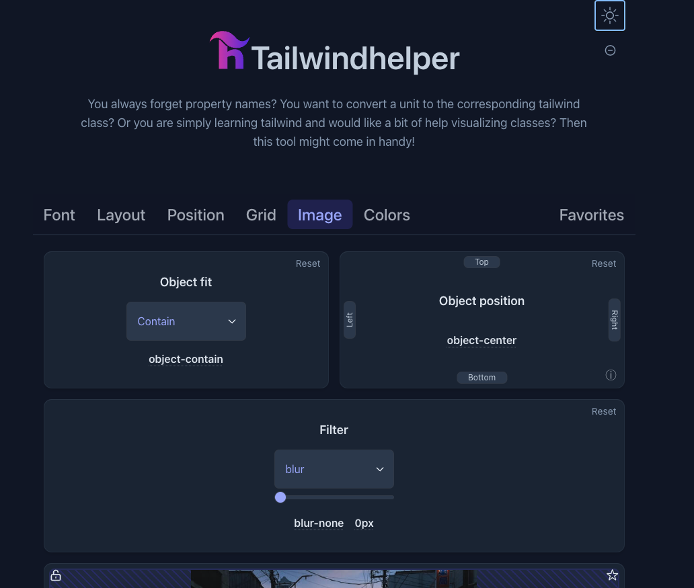

Create motion for reactjs  
#NPM

https://www.npmjs.com/package/react-scroll-motion

#Example

https://www.youtube.com/watch?v=OAx0we521sk

https://codesandbox.io/s/scroll-motion-animation-forked-mp6uc0

This website layout for tailwind

https://layoutsfortailwind.lalokalabs.dev

Create rotate for reactjs

- react-scroll-rotate
  #Example

https://giladk.github.io/react-scroll-rotate/

- This websit is beautiful tailwind 

https://www.hyperui.dev/

- This websit is contain class javaScript and class tailwind

https://www.vechaiui.com/dialog

- Typescript component vechaiUI 

https://github.com/vechai/vechaiui

Tailwind Helper

- Tailwindhelper assists you in styling with tailwindcss. You can visualize tailwind settings, converts your values into tailwind classes, figure out the closest colors with hex values and more.

https://www.tailwindhelper.com/

Openbase

- This website is contain a lot of Package Categories for dev

https://openbase.com/categories/js

- Component for reactjs "www.creative-tim.com"
https://www.creative-tim.com/learning-lab/tailwind-starter-kit/documentation/react/modals/regular

<h1 align="left">Hi 👋! I'm Pern</h1>

###

  
  

###

  
  
  
  
  
  
  
  
  
  
  
  
  
  

###

  
  
  

###

 

###

Profile Readme Generator

Python validate https://develop.sentry.dev/serializers/

Tailwind animation 

https://blog.canopas.com/tailwind-css-custom-animations-b041a1310aab

React before after slider component

https://www.npmjs.com/package/react-before-after-slider-component

Reatjs hook form

https://codesandbox.io/s/react-hook-form-usefieldarray-nested-arrays-x7btr?from-embed

https://www.tailwind-kit.com/components/feature

https://tailgrids.com/components/toggle-switch

https://tailwind-elements.com/docs/standard/components/images/

Tailwind Form HTML
https://ordinarycoders.com/blog/article/tailwindcss-custom-forms

Ebook 
https://www.pdfdrive.com